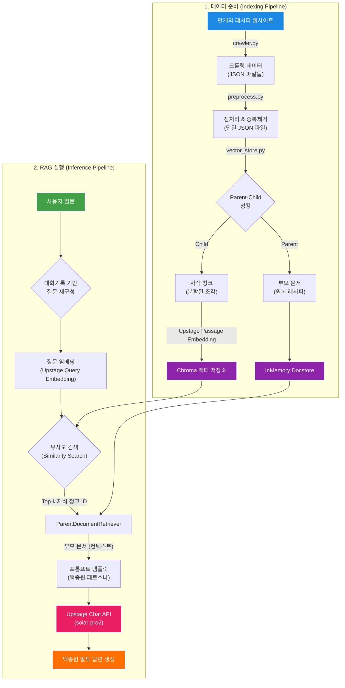
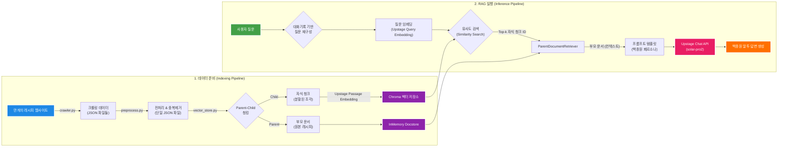

# 요리 레시피 추천하는 백종원 페르소나 QA챗봇

<br>

## 💻 프로젝트 소개
### <프로젝트 소개>


- '만개의 레시피' 사이트에서 백종원 쉐프의 레시피를 기반으로 한 한국어 RAG 질의응답 어시스턴트입니다.
- Streamlit WebUI에서 대화형으로 질문하고 사용자의 요리 질문에 백종원 쉐프의 말투로 답변하는 QA 봇입니다.

### <챗봇 소개>
- Upstage Chat/Embeddings와 chromaDB를 활용해 백종원식 요리 레시피의 검색·생성을 결합합니다.
- 크롤링 → 전처리 → json 로드 → 텍스트 분할 → 임베딩 생성 → 벡터 검색 → 답변 생성 파이프라인을 구현했습니다.
- 백종원식 요리 레시피, 개인화된 요리 추천 등을 지원합니다.

<br>


## 👨‍👩‍👦‍👦 팀 구성원

|  |  |  |  | 
| :--------------------------------------------------------------: | :--------------------------------------------------------------: | :--------------------------------------------------------------: | :--------------------------------------------------------------: | 
|            [오승태](https://github.com/ohseungtae)             |            [이경도](https://github.com/kdlee02)             |            [홍상호](https://github.com/ERyukSa)             |            [김재훈](https://github.com/willy0629)             |            
|                   팀장,   111                |                   1111<br/>111                  |                  111<br/>111                   |                   1111<br/>1111                   |

<br>

## 🔨 개발 환경 및 기술 스택

- **주 언어**: Python 3.10+
- **패키지 관리**: pip, venv
- **프론트엔드**: Streamlit
- **주요 라이브러리**:
  - **LangChain**: Community, Core, Upstage 등 RAG 파이프라인 구축
  - **ChromaDB**: 벡터 검색 및 저장
  - **BeautifulSoup**: 웹 크롤링 및 HTML 파싱
  - **LangSmith**: LLM 애플리케이션 추적 및 평가
  - **NLTK, rouge-score, sentence-transformers**: 정량 평가 지표 계산
  - **python-dotenv**: 환경변수 관리
- **API**: Upstage AI (Chat, Embeddings)
- **버전 및 이슈관리**: GitHub
- **협업 툴**: GitHub, Slack

<br>

## Upstage API Key 발급
1. [Upstage AI Console](https://console.upstage.ai/docs/getting-started)에 접속합니다.
2. 상단 **Dashboard** 를 클릭
3. 좌측 메뉴에서 **API Key**를 선택합니다.
4. **API Key 발급** 버튼을 클릭하여 키를 생성합니다.
5. 발급된 API Key를 복사하여  `.env` 파일에 추가합니다. (env_template파일을 참고) (`UPSTAGE_API_KEY=발급받은_API_키`)

<br>

## ⚙️ 설치 및 실행 방법

### 1. 프로젝트 복제

```bash
git clone [https://github.com/ohseungtae/upstageailab-langchain-pjt-langchain_3.git](https://github.com/ohseungtae/upstageailab-langchain-pjt-langchain_3.git)
cd recipe-qa-engine
```

### 2. 가상 환경 설정 및 라이브러리 설치

```bash
# 가상 환경 생성
python -m venv .venv

# 가상 환경 활성화 (Windows)
.venv\Scripts\activate
# 가상 환경 활성화 (macOS/Linux)
source .venv/bin/activate

# 필요 라이브러리 설치
pip install -r requirements.txt
```
<br> 

### 3. API 키 설정

프로젝트 루트 디렉토리에 `.env` 파일을 생성하고 아래와 같이 API 키와 LangSmith 정보를 입력하세요.

```ini
# .env
OPENAI_API_KEY="sk-..."
UPSTAGE_API_KEY="sk-..."

# LangSmith 연동을 위한 설정
LANGCHAIN_TRACING_V2="true"
LANGCHAIN_API_KEY="ls__..."
LANGCHAIN_PROJECT="Recipe QA Engine" # LangSmith 프로젝트 이름
```
<br>

### 4. 실행 명령어 (`main.py`)

모든 작업은 `main.py`를 통해 실행됩니다.

#### **1단계: 데이터 준비 (최초 1회)**

크롤링부터 벡터 DB 구축까지 모든 데이터 준비 과정을 한 번에 실행합니다.

```bash
python main.py prepare-data
```

> **💡 Tip:** 기존 DB를 삭제하고 새로 구축하고 싶다면 `--rebuild` 옵션을 추가하세요.
> `python main.py prepare-data --rebuild`

---

#### **2단계: 챗봇 앱 실행 또는 성능 평가**

데이터 준비가 완료되면, 아래 두 가지 작업 중 하나를 선택하여 실행할 수 있습니다.

**A) Streamlit 웹 앱 실행**

백종원 쉐프와 대화할 수 있는 웹 앱을 실행합니다.

```bash
python main.py app
```

**B) RAG 성능 평가**

LangSmith를 사용하여 RAG 파이프라인의 성능을 평가합니다.

```bash
python main.py evaluate
```

<br>

## 📂 프로젝트 구조 

프로젝트는 역할과 책임에 따라 명확하게 모듈화되었습니다.

```
/recipe-qa-engine/
├── src/
│   ├── app/                  # Streamlit UI 관련 코드
│   │   └── ui.py
│   ├── core/                 # 핵심 로직 (설정, 파이프라인, 실행기)
│   │   ├── config.py
│   │   ├── pipeline.py
│   │   └── runner.py
│   ├── data_processing/      # 데이터 수집 및 전처리
│   │   ├── crawler.py
│   │   └── preprocess.py
│   ├── evaluation/           # 성능 평가 로직
│   │   └── evaluator.py
│   ├── rag_components/       # RAG 파이프라인의 핵심 구성 요소
│   │   ├── llm_handler.py
│   │   ├── retriever.py
│   │   └── vector_store.py
│   └── utils/                # 보조 유틸리티
│       └── docstore.py
│
├── data/                     # 모든 데이터 관리 폴더
│   ├── crawled/              # (Git 미추적) 크롤링 원본 데이터
│   ├── preprocessed/         # (Git 미추적) 전처리된 데이터
│   └── evaluation_sets/      # 평가용 데이터셋
│
├── chroma_db/                # (Git 미추적) 로컬 벡터 DB
│
├── .env                      # (Git 미추적) API 키 등 비밀 정보
├── .gitignore
├── requirements.txt          # 프로젝트 의존성 라이브러리
└── main.py                   # ✨ 프로젝트 실행을 위한 단일 진입점
```

<br>

## 📊 RAG 시스템 아키텍처

이 프로젝트는 **데이터 준비(Indexing)**와 **RAG 실행(Inference)**의 두 가지 파이프라인으로 구성됩니다.


<br>



<br>

## ✨ 프로젝트 핵심 기능

-   **데이터 수집**: 특정 키워드("백종원")로 레시피를 검색하여 동적으로 크롤링
-   **데이터 전처리**: 수집된 데이터에서 불필요한 정보를 제거하고 LLM이 이해하기 쉬운 형태로 가공
-   **RAG 기반 QA**: ChromaDB와 `ParentDocumentRetriever`를 사용해 정확도 높은 답변 생성
-   **페르소나 적용**: 시스템 프롬프트를 통해 LLM이 '백종원' 쉐프의 말투와 스타일을 모방하도록 설정
-   **대화 기록 관리**: 이전 대화 내용을 기억하여 연속적인 질문에도 맥락에 맞는 답변 제공
-   **LangSmith 연동**: 모든 처리 과정을 추적하고 성능을 정량적으로 평가

<br>

## 🎯 백종원 챗봇 

-   **💬 대화형 챗봇**: 백종원 스타일의 친근한 말투로 요리 레시피 안내, 연속 대화 지원 (이전 대화 내용 기억), 실시간 응답
-   **🎨 사용자 친화적 인터페이스**: 예시 질문 버튼 제공, 대화 기록 초기화 기능이 있는 반응형 디자인
-   **🔍 스마트 검색**: 백종원 레시피 데이터베이스에서 정확한 정보 검색하고 출처 정보 제공

<br>

## 📊 프로젝트 워크플로우

이 프로젝트는 다음과 같은 단계로 진행됩니다. 각 단계는 `main.py`의 명령어를 통해 실행할 수 있습니다.

1.  **데이터 수집 (Crawling)**
    * `main.py prepare-data` 실행 시 `crawler.py`가 '만개의 레시피' 사이트에서 '백종원' 키워드로 검색된 레시피의 제목, 재료, 조리 절차, 원문 URL을 수집하여 `data/crawled/` 폴더에 JSON 파일로 저장합니다.

2.  **데이터 전처리 (Preprocessing)**
    * `preprocess.py`가 크롤링된 모든 JSON 파일을 읽어옵니다.
    * 레시피 제목에서 '백종원', '만들기' 등 불필요한 키워드를 제거하고, 재료 목록을 일관된 형식으로 정리합니다.
    * **제목 유사도**를 비교하여 중복된 레시피를 제거하고, 정제된 데이터를 `data/preprocessed/all_recipes_cleaned.json` 단일 파일로 통합 저장합니다.

3.  **벡터 DB 구축 (Vector DB Indexing)**
    * `vector_store.py`가 전처리된 JSON 파일을 로드하여 LangChain의 `Document` 객체로 변환합니다.
    * **Parent-Child 청킹**: 각 레시피(부모 문서)를 검색에 용이하도록 작은 조각(자식 청크)으로 분할합니다.
    * Upstage의 `solar-embedding-1-large-passage` 모델을 사용하여 자식 청크들을 임베딩하고, ChromaDB 벡터 저장소(`chroma_db/`)에 인덱싱합니다.

4.  **RAG 파이프라인 실행 (QA & Evaluation)**
    * `main.py app` 또는 `main.py evaluate` 실행 시 `pipeline.py`가 RAG 시스템을 초기화합니다.
    * 사용자 질문이 들어오면, `solar-embedding-1-large-query` 모델로 질문을 임베딩하여 벡터 DB에서 가장 유사한 레시피 조각(자식 청크)들을 검색합니다.
    * `ParentDocumentRetriever`가 검색된 자식 청크에 해당하는 원본 레시피(부모 문서) 전체를 LLM에 전달합니다.
    * `llm_handler.py`에 정의된 시스템 프롬프트(백종원 페르소나)와 검색된 레시피 정보를 바탕으로, Upstage `solar-pro2` 모델이 최종 답변을 생성합니다.

<br>

## 🛠️ 기술 상세 설명

### 1. 데이터 수집 및 전처리

* **크롤링 (`crawler.py`)**: `requests`와 `BeautifulSoup` 라이브러리를 사용하여 웹 페이지의 HTML을 파싱합니다. 재료 추출 시, 웹사이트의 복잡한 HTML 구조를 분석하여 `<ul>`과 `<li>` 태그 내의 텍스트를 정확히 가져오고, '구매'와 같은 불필요한 버튼 텍스트를 제거하는 로직을 포함했습니다.
* **전처리 및 중복 제거 (`preprocess.py`)**: 단순 텍스트 정제를 넘어, `difflib.SequenceMatcher`를 사용하여 레시피 제목 간의 유사도를 계산합니다. 설정된 임계값(기본 0.75)을 초과하는 제목을 가진 레시피는 중복으로 간주하고 제거하여 데이터의 품질을 높였습니다.

### 2. RAG 아키텍처

* **임베딩 모델**: 문서(레시피) 임베딩에는 **passage용 모델**(`solar-embedding-1-large-passage`)을, 사용자 질문 임베딩에는 **query용 모델**(`solar-embedding-1-large-query`)을 사용하여 각 목적에 최적화된 성능을 추구했습니다.
* **`ParentDocumentRetriever`**: 검색 정확도와 답변 품질을 모두 높이기 위해 이 전략을 채택했습니다.
    * **검색 단계**: 작고 의미가 집중된 **자식 청크**를 벡터 검색하여, 사용자의 구체적인 질문(예: "돼지고기 먼저 볶아야 하나요?")과 관련된 부분을 정확히 찾아냅니다.
    * **답변 생성 단계**: 검색된 자식 청크의 **부모 문서(원본 레시피 전체)**를 LLM에 전달합니다. 이를 통해 LLM은 단편적인 정보가 아닌, 레시피의 전체 맥락(모든 재료, 전체 조리 과정, 팁 등)을 이해하고 풍부하고 완전한 답변을 생성할 수 있습니다.

### 3. 프롬프트 엔지니어링 (페르소나 적용)

`llm_handler.py`의 시스템 프롬프트는 '백종원'이라는 명확한 페르소나를 구현하기 위해 다음과 같이 세심하게 설계되었습니다.

* **성격 및 말투 정의**: 충청도 사투리(`~유`, `~쥬`), 친근하면서도 핵심을 짚는 화법 등 구체적인 가이드라인을 제시합니다.
* **대화 패턴 명시**: "가벼운 핀잔으로 시작 -> 친절한 설명 -> 따뜻한 격려로 마무리"라는 일관된 흐름을 지시합니다.
* **출력 형식 강제**: 답변의 가독성을 높이기 위해 마크다운 사용, 소제목(`### 🍳 필요한 재료`) 및 번호 목록 활용을 명시적으로 요구합니다.
* **규칙 및 제약사항**: 사실 기반 답변, 출처 URL 명시, 불필요한 괄호 설명 제거 등 엄격한 규칙을 부여하여 답변의 품질과 일관성을 제어합니다.

### 4. 성능 평가 (`LangSmith`)

`evaluator.py`는 RAG 파이프라인의 성능을 다각도로 측정하기 위해 정성 및 정량 평가를 모두 사용합니다.

* **정성 평가 (LLM-as-a-Judge)**:
    * **Faithfulness**: 답변이 검색된 레시피 정보에 얼마나 충실한가? (환각 방지)
    * **Relevance**: 답변이 사용자의 질문과 얼마나 관련이 있는가?
    * **Persona**: 답변이 '백종원' 페르소나를 얼마나 잘 따르는가?
* **정량 평가**:
    * **ROUGE-L**: 정답과 모델 답변 간의 가장 긴 공통 부분 수열을 측정하여 내용의 일치도를 평가합니다.
    * **BLEU**: 번역 모델 평가에 주로 쓰이며, 모델 답변이 정답과 얼마나 유사한 단어 시퀀스를 갖는지 측정합니다.
    * **METEOR**: 동의어, 어근 등을 고려하여 BLEU보다 유연하게 문장의 의미적 유사도를 평가합니다.
    * **Semantic Similarity**: 문장 임베딩 모델을 사용하여 정답과 모델 답변 간의 코사인 유사도를 계산, 의미적 유사성을 직접 측정합니다.

<br>

## 📌 프로젝트 회고
### 멤버별 소감

#### 오승태
- 
#### 홍상호
- 
#### 이경도
- 
#### 김재훈
- 
<br>
